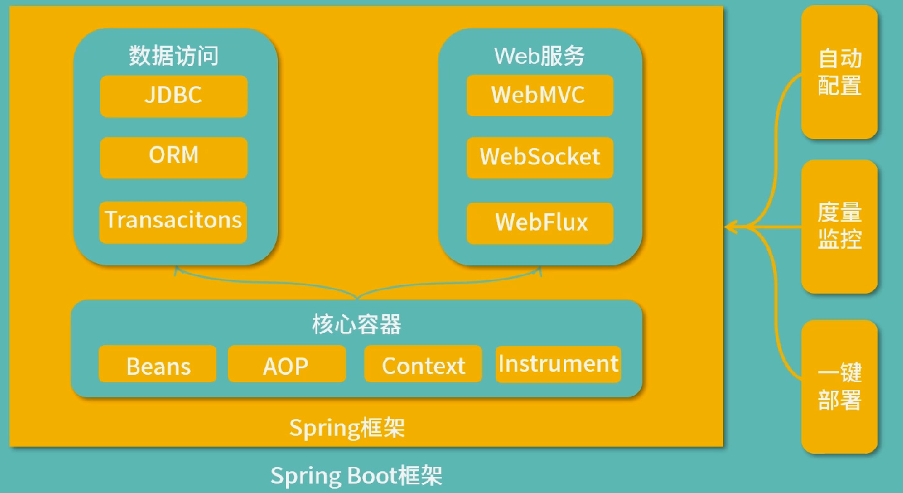
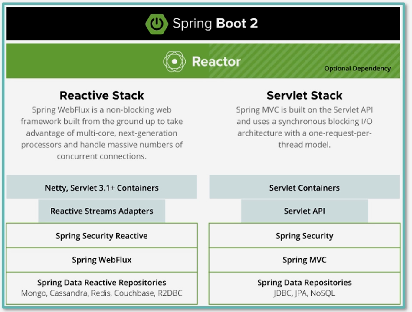
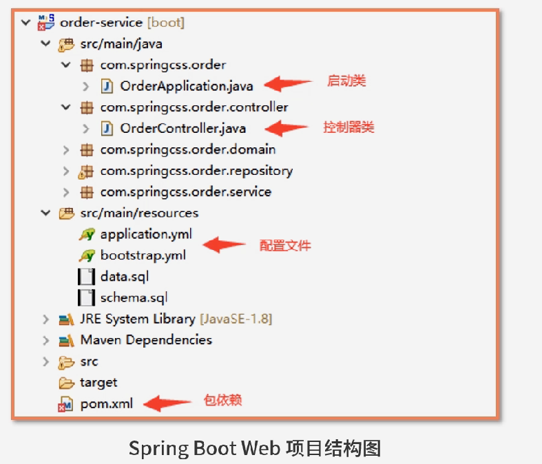

## 介绍
+ 看似简单，实则复杂，因为有很多隐式功能
+ 技术体系和组件众多
+ 微服务架构(Spring cloud)
+ 响应式编程
+ 云原生
+ Web应用
+ 事件驱动
+ Serverless架构
+ 批处理(Spring Batch)
+ 数据访问：JDBC、ORM、Transactions
+ Web服务：WebMVC、WebSocket、WebFlux
+ 核心容器：Beans(IoC)、AOP、Context、Instrument
+ 自动配置、度量监控、一键部署
+ 集成了Tomcat、Jetty、Netty、Servlet可供选择
> 约定优于配置
> 内置监控(Actuator):监控内存、JVM、GC等信息

## 框架
Spring + Web

Spring Boot异步 & Spring MVC 同步) 

> 异步和同步是可以混合使用的

## Spring MVC 到 Spring Boot
+ 繁重的xml配置可选的使用 注解、yml
+ started可以简化配置
+ 一键启动，不用额外部署war到Tomcat上
+ 自动监控Actuator，可以在REST访问性能数据

## 代码架构


## Hello World
+ 可以通过引入依赖使用spring-boot-starter-web
```
<groupId>org.springframework.boot</groupId>
<artifactId>spring-boot-starter-web</artifactId>
<version>3.0.4</version>
```
+ 可以用spring initialiezr网站 start.spring.io 
+ 可以安装 spring boot helper插件，新建项目,建好后在project文件夹上右键“Add Framework Support”选择Maven
> 若出现spring版本不对，则换一个低的parent的版本
+ 启动类需要在高层次、controller在低层次
``` java
// src/main/java/com/example/demo/DemoApplication.java
package com.example.demo;

import org.springframework.boot.SpringApplication;
import org.springframework.boot.autoconfigure.SpringBootApplication;

@SpringBootApplication
public class DemoApplication {

	public static void main(String[] args) {
		SpringApplication.run(DemoApplication.class, args);
	}

}

// src/main/java/com/example/demo/ctrl/Hello.java
package com.example.demo.ctrl;

import org.springframework.stereotype.Controller;
import org.springframework.web.bind.annotation.RequestMapping;
import org.springframework.web.bind.annotation.ResponseBody;

@Controller
public class Hello {

    @RequestMapping(value = "/")
    @ResponseBody
    public String hello() {
        return "hello world";
    }
}
```
+ 可以在点击application的箭头运行，也可以打成jar包运行

## 术语
+ 端点： Endpoint，即一个url路径
+ label：版本控制信息
+ profile：配置文件对应的环境
```
/{application}-{profile}.yml
/{label}/{application}-{profile}.yml
/{application}-{profile}.properties
/{label}/{application}-{profile}.properties
```

