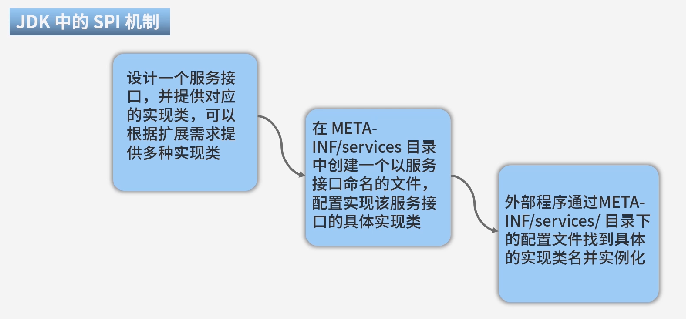
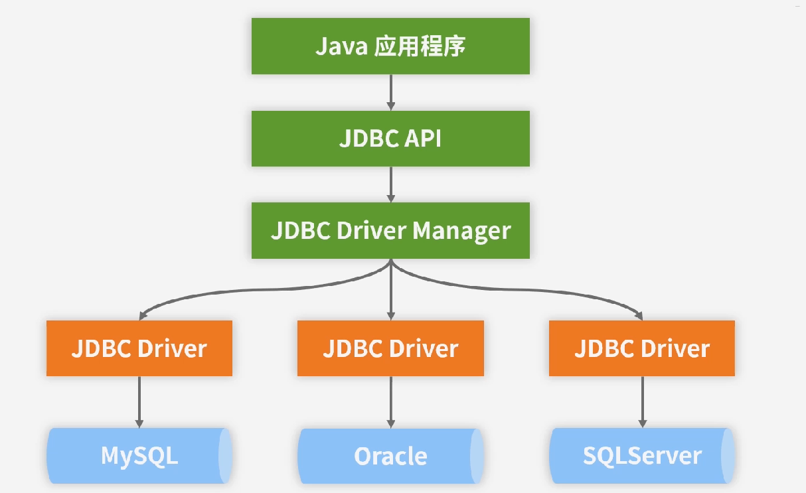

## 介绍

+ 看似简单，实则复杂，因为有很多隐式功能
+ 技术体系和组件众多
+ 微服务架构(Spring cloud)
+ 响应式编程
+ 云原生
+ Web应用
+ 事件驱动
+ Serverless架构
+ 批处理(Spring Batch)
+ 数据访问：JDBC、ORM、Transactions
+ Web服务：WebMVC、WebSocket、WebFlux
+ 核心容器：Beans(IoC)、AOP、Context、Instrument
+ 自动配置、度量监控、一键部署
+ 集成了Tomcat、Jetty、Netty、Servlet可供选择

> 约定优于配置的思路。底层仍然是Spring

> 内置监控(Actuator):监控内存、JVM、GC等信息

## 框架

Spring + Web

Spring Boot异步 & Spring MVC 同步)


> 异步和同步是可以混合使用的

## Spring MVC 到 Spring Boot

+ 繁重的xml配置可选的使用 注解、yml
+ starter可以简化配置
+ 一键启动，不用额外部署war到Tomcat上
+ 自动监控Actuator，可以在REST访问性能数据

## 代码架构


## Hello World

+ 可以通过引入依赖使用spring-boot-starter-web

```
<groupId>org.springframework.boot</groupId>
<artifactId>spring-boot-starter-web</artifactId>
<version>3.0.4</version>
```

+ 可以用spring initialiezr网站 start.spring.io
+ 可以安装 spring boot helper插件，新建项目,建好后在project文件夹上右键“Add Framework Support”选择Maven

> 若出现spring版本不对，则换一个低的parent的版本

+ 启动类需要在高层次、controller在低层次

```java
// src/main/java/com/example/demo/DemoApplication.java
package com.example.demo;

import org.springframework.boot.SpringApplication;
import org.springframework.boot.autoconfigure.SpringBootApplication;

@SpringBootApplication
public class DemoApplication {

	public static void main(String[] args) {
		SpringApplication.run(DemoApplication.class, args);
	}

}

// src/main/java/com/example/demo/ctrl/Hello.java
package com.example.demo.ctrl;

import org.springframework.stereotype.Controller;
import org.springframework.web.bind.annotation.RequestMapping;
import org.springframework.web.bind.annotation.ResponseBody;

@Controller
public class Hello {

    @RequestMapping(value = "/")
    @ResponseBody
    public String hello() {
        return "hello world";
    }
}
```

+ 可以在点击application的箭头运行，也可以打成jar包运行

## 术语

+ 端点： Endpoint，即一个url路径
+ label：版本控制信息
+ profile：配置文件对应的环境dev、prod等

```
/{application}-{profile}.yml
/{label}/{application}-{profile}.yml
/{application}-{profile}.properties
/{label}/{application}-{profile}.properties
```

+ 可以用yml也可以用properties文件配置
+ 在application.properties设置spring.profiles.active=test则会启用application-test.properties，也可以在运行时指定该参数
+ 可以用注解确定环境 @Profile("prod")
+ @Value注解可以注入配置项内容

```
@Value("${springcss.order.point}")
private int point;
```

+ @ConfigurationProperties 可以用前缀注入多个值,或者注入到HashMap中

```
@ConfigurationProperties(prefix="springcss.order")
```

+ @PropertySource 可以指定从哪个配置文件中获得配置信息
+ @PropertySources 可以指定从哪些配置文件中获得配置信息
+ spring.config.location 可以指定配置文件的默认加载位置
+ 多个地方存在application.properties时，则高优先级的会覆盖低优先级的值

## AutoConfiguration 自动配置

+ @SpringBootApplication 包含下面三个注解
+ @ComponentScan 扫描基于@Component类所在包下所有的需要注入的类，并把相关Bean定义批量加载到容器中
+ @SpringBootConfiguration 是空注解，使用了@Configuration注解，提供就JavaConfig配置类的实现。意味着替代xml。
+ @EnableAutoConfiguration 包含以下2个注解
+ @AutoConfigurationPackage 对该注解下的包进行自动配置
+ @Import(AutoConfigurationPackages.Registrar.class) 用来动态创建Bean
+ SpringBoot提供了100多个AutoConfiguration类
+ @ConditionalOn 按条件确定是否装配
+ @Bean，在配置类中，可以替代xml实现对象的new

## JDK的SPI机制

+ 
+ SpringFactoriesLoader 类是类似的技术实现配置加载，放在META-INF/spring.factories文件夹下

## Bean

+ In Spring, the objects that form the backbone of your application and that are managed by the Spring IoC container are called beans. A bean is an object that is instantiated, assembled, and otherwise managed by a Spring IoC container.
+ 在 Spring 中，构成应用程序主干并由Spring IoC容器管理的对象称为bean。bean是一个由Spring IoC容器实例化、组装和管理的对象。
+ IoC就是一个对象定义其依赖关系而不创建它们的过程
+ Bean容器，或称spring ioc容器，主要用来管理对象和依赖，以及依赖的注入
+ bean是一个Java对象，根据bean规范编写出来的类，并由bean容器生成的对象就是一个bean
+ 所有属性为private
+ 提供默认构造方法
+ 提供getter和setter
+ 实现serializable接口

## JDBC， Java DataBase Connectivity

+ 
+ DriverManager、DataSource(连接池)、Connection、Statement、ResultSet
+ JdbcTemplate: Spring提供的JDBC方便访问的类
+ SimpleJdbcInsert: 在JdbcTemplate基础上提供批量插入操作
+ Spring Data JPA: 提供ORM功能，可以结合@Query注解

## Spring注入

参考 https://zhuanlan.zhihu.com/p/29426019
参考 https://zhuanlan.zhihu.com/p/64001753

+ 编写代码，指定构造器(留给spring去注入)、指定set方法
+ 编写xml配置，配个各个对象的关系，交给Spring去new对象，并且对象传递到另一个对象的属性中

## Spring 历史

+ Sun公司，EJB(Enterprise Java Bean)需要两个配置文件，而**Web容器**调用**EJB容器**又需要配置文件，很麻烦、性能差
+ 2002年音乐家 Rod Johnson 在 《ExpertOne-on-One J2EE Design and Development》 提出Spring的概念
+ 2004， Spring 1.0， 减低代码耦合，IoC、AOP，减少try-catch的编写，集成Hibernate
+ JDK5提供注解功能，Spring 2.0引入少量注解，@Component、@Service
+ Spring 3.0，对于业务类使用注解，对于一些公用的Bean、第三方资源等则使用XML进行配置
+ Spring 4.x大量使用注解
+ 2018年，Spring Boot 2.0 基于Spring 5, 主要使用注解。

```
创建独立的Spring应用程序
嵌入的Tomcat、Jetty或者Undertow，无须部署WAR文件
允许通过Maven来根据需要获取starter
尽可能地自动配置Spring
提供生产就绪型功能，如指标、健康检查和外部配置
对没有代码生成，对XML没有要求配置
```

## 配置项 Property

+ 主配置文件 application.properties
+ 配置项列表 https://docs.spring.io/spring-boot/docs/current/reference/html/application-properties.html#appendix.application-properties.web

```
server.port=8080  // web端口
debug=true // 开启更多信息
```

## JSP配置

+ 类似返回html文件，只是返回jsp文件
+ 参考 https://blog.csdn.net/weixin_53168000/article/details/126662098

## Ioc， Inversion of Control

+ 不用new，而用“描述”来创建对象，并且描述依赖关系
+ 在Spring Boot，是用“注解作为描述”，不再是xml
+ 每个被Spring管理的对象称为 Spring Bean
+ 管理Bean的容器称为 IoC容器
+ 所有IoC容器都必须实现 BeanFactory 接口。该接口具有以下方法

```
getBean 获得Bean，可以按类型或者按名称获取
isSingleton 是否是单例
isPrototype 是否不是单例
```

+ BeanFactory具有 子接口 ApplicationContext。扩展了MessageSource、EnvironmentCapable、ApplicationEventPublisher、ResourcePatternResolver功能
+ Spring Boot中通过注解装配Bean到IoC容器中

```java
// --------- User.java 
package ioc;
// POJO，Plain Ordinary Java Object
public class User {
    private Long id;
    private String userName;
    private String note;
    /** setters and getters **/
}

// ---------ConfigIt.java 
package ioc;
import org.springframework.context.annotation.Bean;
import org.springframework.context.annotation.Configuration;

@Configuration  // 需要在注解类里注册Bean
public class ConfigIt {

    @Bean(name="user")  // 注册名为user，若不填name参数，则注册为initUser。@Bean表示容器装配
    public User initUser(){
        User user = new User();
        user.setId(1L);
        user.setUserName("user_name_1");
        user.setNote("note1");
        return user;
    }
}

// ----------testIoc.java 
package ioc;

import org.springframework.context.annotation.AnnotationConfigApplicationContext;

public class testIoc {
    public static void main(String[] args) {
        AnnotationConfigApplicationContext ctx = new AnnotationConfigApplicationContext(ConfigIt.class);
        User user = ctx.getBean(User.class);
        System.out.println(user.getUserName());
    }
}
```

## IoC装配、注入

+ 装配是指将对象放入IoC、注入是指从IoC拿到对象

> 前提是 @Configuration 指明这个是配置类

+ 通过@Bean装配
+ 通过@Component扫描
+ 通过@ComponentScan指定扫描策略。默认扫描该类的当前包和子包。也可以通过basePackages和basePackageClasses指定，或者excludeFilters 排除
+ 通过@Value指定某字段的具体的数值。如直接使用配置文件中的值@Value("${database.driverName}")；通过@ConfigurationProperties可以根据前缀批量注入数值；@PropertySource指定从那个配置文件取值

> Spring EL 可以引入计算 @Value("#{T(System).currentTimeMillis() }")

+ 使用@Bean将第三方包提供的对象放入IoC容器
+ 可以用@ImportResource来调用xml文件进行装配：@ImportResource(value={"classpath:spring-other.xml"})
+ 用@AutoWired 可以(根据类型)从IoC拿到对象来用

```
@Autowired 
private Animal animal = null;
```

+ 条件装配：满足条件才能装配，@Conditional(TheCondition.class)，TheCondition需要实现Condition接口，实现matches方法

## @Autowired

+ 若找到的类型匹配的Bean对象不止一个，则抛出错误
+ 若不一定找到的可以声明required。@Autowired(required = false)
+ 可以在待装配的Class上声明是@Primary，则多个冲突时，自动优先用这个
+ @Qualifier 可以根据名称去注入，结合类型和名称
+ 也可以放到函数形参中

## Bean的生命周期

+ 有时候我们也需要自定义初始化或者销毁Bean的过程
+ 生命周期包括 (1)Bean定义 (2)Bean初始化 (3)Bean生存期 (4)Bean销毁
  
+ Bean的定义

```
资源定位：Spring通过我们的配置，如＠ComponentScan定义的扫描路径去找到带有＠Component的类
找到了资源，那么它就开始解析，并且将定义的信息保存起来。把Bean定义发布到SpringIoC容器。
```

> 此时还未生成Bean实例

+ Bean初始化：(饿汉式)默认是根据Bean的定义进行实例化，并且根据@Autowired进行注入对应的属性值。

> (懒汉式)ComponentScan中还有一个配置项lazyInit,可以延迟初始化，使用时再初始化。

+ 可以通过＠PreDestroy定义销毁方法，如数据库连接的关闭

## Bean的作用域

> 复用或不复用实例

+ **singleton**：装配为单例，默认情况。@Scope(ConfigurableBeanFactory.SCOPE_SINGLETON)
+ **prototype**：每次取值得到一个新的Bean。 @Scope(ConfigurableBeanFactory.SCOPE_PROTOTYPE)
+ **session**：HTTP会话。@Scope(WebApplicationContext.SCOPE_SESSION)
+ **application**： Web应用。可以用单例代替。@Scope(WebApplicationContext.SCOPE_APPLICATION)
+ request：单次请求。 @Scope(WebApplicationContext.SCOPE_REQUEST)
+ globalSession： 在一个全局的HTTPSession中，一个Bean定义对应一个实例。很少用

## @Profile切换开发环境

+ 即，在不同的环境下代码生效。需要spring.profiles.active或者spring.profiles.default已配置才会生效@Profile
+ @Profile("dev")
+ @Profile("test")
+ @Profile("prod")
+ spring.profiles.active 激活不同的配置文件环境
+ spring.profiles.default 默认配置环境

## AOP 约定编程

+ SpringAOP只能对方法进行拦截
+ Proxy拦截器约定的例子 https://github.com/doglex/springboot-2.x-learning/tree/master/chapter4/src/main/java/com/springboot/chapter4
+ 按照一定的规则，就可以将自定义的代码织入事先约定的流程中
+ 因此可以减少大量重复的流程代码，自己写的核心逻辑是"织入"到流程中

> 代码更简洁，可维护性提高

+ Join Point 连接点：具体被拦截的目标，一般就是某个方法
+ Point Cut 切点：通过正则式和指示器适配多个 Join Point
+ Advice 通知：前置通知（before advice）、后置通知（after advice）、环绕通知（around advice）、事后返回通知（afterReturning advice ）、异常通知( afterThrowing advice）
+ Target 目标对象：被代理对象
+ Introduction 引入：引入新的类和其方法，增强现有Bean的功能
+ Weaving 织入：通过**动态代理**技术，为原有服务对象生成代理对象，然后将与切点定义匹配的连接点**拦截**，并按约定将各类通知织入约定流程的过程
+ Aspect 切面：一个可以定义切点、各类通知和引入的内容，SpringAOP将通过它的信息来增强Bean的功能或者将对应的方法织入流程
  

## AOP步骤

+ 第一步，选好连接点，即，选一个函数要对其进行拦截
+ 第二步，开发切面。技巧，指定切点，就可以省去每个注解的地方都写正则式了

```java
@Aspect
public class MyAspect {
    @Pointcut("execution(* aop_demo.UserServiceImpl.printUser(..))")
    public void cut() {}

    @Before("cut()")
    public void before() {
        System.out.println("before -------");
    }
}

+ @Aspect 说明这个类是切面
+ @Pointcut 指定切点。定义完成就可以给 @Before、@After、@AfterReturning、@AfterThrowing使用了
+ execution 表示正在执行的时候拦截
+ * 表示任意返回类型
+ aop_demo.UserServiceImpl.printUser表示要拦截这个方法
+ .. 表示方法里面允许任意参数
```
+ 第三步， 在Controller中常规的使用
``` java 
@Controller
@RequestMapping("/user")
public class UserController {

    @Autowired
    private UserService userService = null;

    @RequestMapping("/print")
    @ResponseBody
    public User printUser(Long id, String userName, String note) {
        User user = new User();
        user.setId(id);
        user.setUsername(userName);
        user.setNote(note);
        userService.printUser(user);
        return user;
    }
}
```
+ 第四步，在应用中装配Aspect对象
```
@SpringBootApplication(scanBasePackages = {"aop_demo"})
public class TheApplication {

    @Bean(name="MyAspect")
    public MyAspect initMyAspect() {
        return new MyAspect();
    }
    public static void main(String[] args) {
        SpringApplication.run(TheApplication.class, args);
    }
}
```

